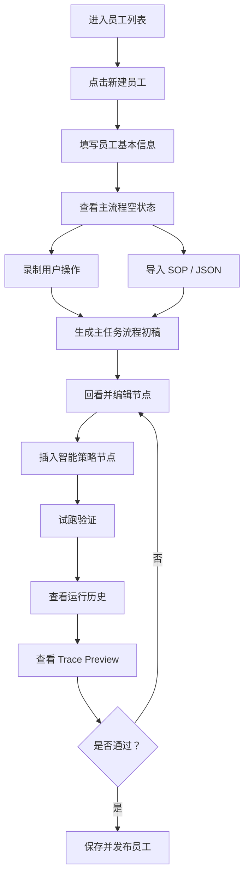

# 员工创建交互流程设计稿

本文档用于沉淀员工创建页的交互流程和页面信息架构，作为后续重构流程节点页面布局的讨论基线。

本版移除“用文字生成草稿”的支持。主流程初稿只保留两类来源：

- 录制用户操作，作为 MVP 默认路径。
- 导入 SOP / JSON，作为已有流程资产的入口。

## 1. 设计目标

员工创建页不是录制工具页，而是数字员工的主流程编辑器。

用户真正要完成的任务是：

1. 登记员工基本信息和工作目标。
2. 通过录制用户操作生成主任务流程初稿。
3. 把初稿里的浏览器操作节点界面化展示出来，作为后续查看、编辑、调试的核心对象。
4. 在不确定、需要判断、需要恢复的位置插入智能策略节点。
5. 调试运行主流程，通过运行记录和 Trace Preview 判断流程是否成功。
6. 失败时快速定位节点、事件、原因，并回到流程中修改。

因此页面主体内容应始终围绕“主任务流程”展开。录制入口、导入工具、策略编辑器、Trace Preview 都是围绕主流程的上下文能力。

## 2. 全局布局原则

员工创建/编辑页使用统一三栏结构：

```text
顶部操作栏：
  返回 / 员工名称 / 保存 / 试跑 / 发布

左侧流程导航：
  1 定义工作
  2 录制主路径
  3 标注灵活节点
  4 试跑验证

中间主工作区：
  第 1 步展示定义工作表单。
  第 2/3/4 步展示主任务流程。
  主任务流程从录制主路径开始成为最重要、最显眼的区域。

右侧上下文面板：
  随当前步骤变化：
  - 定义工作：不强制显示右侧面板，表单可直接占据主工作区
  - 录制主路径：录制/导入工具
  - 标注灵活节点：智能节点配置
  - 试跑验证：Trace Preview 和失败详情
```

第 1 步优先降低认知负担，让用户完成基本登记；从第 2 步开始，中间主工作区保持为主任务流程，右侧上下文面板变化。

## 3. 左侧步骤

### 3.1 定义工作

目标：登记员工基本信息，并让平台理解这个员工要完成什么工作。

主要输入：

- 员工名称。
- 工作目标。
- 目标网站。
- 运行方式：手动、定时、API 触发。
- 数据来源：CSV / JSON / XLSX、手动输入、页面现有数据、页面抽取结果。

页面主体：

- 主工作区直接展示定义工作表单。
- 不在页面中心展示主流程空状态。
- 录制和导入入口可以在表单底部或下一步呈现，不作为本页主体。

### 3.2 录制主路径

目标：用真实用户操作生成主任务流程初稿。

页面主体：

- 中间始终展示主任务流程列表。
- 右侧展示录制工具和导入入口。

录制方式：

- 打开独立录制窗口。
- 用户操作目标网页。
- 系统捕获打开网页、点击、输入、按键、等待、校验、抽取等动作。
- 动作实时进入主任务流程列表。

导入方式：

- 导入 SOP / JSON。
- 系统解析为主任务流程节点。
- 导入后仍进入同一套主任务流程列表。

### 3.3 标注灵活节点

目标：在已有主流程中插入智能策略节点。

页面主体：

- 中间展示可选中、可排序、可编辑的主任务流程节点。
- 右侧展示智能节点配置器。

交互规则：

- 点击主流程节点后，该节点进入选中状态。
- 点击“插入智能节点”时，智能节点插入到选中节点之前。
- 如果没有选中节点，插入到流程末尾。
- 智能节点和普通动作节点都在同一个主任务流程列表中显示。

MVP 智能节点类型：

- 智能判断：判断成功、失败、登录、验证码、无结果等页面状态。
- 智能选择：从列表、搜索结果或表格中选择符合条件的项。
- 智能抽取：按自然语言描述抽取页面信息。
- 异常恢复：locator 失败或校验失败时尝试恢复，或给出修复建议。

### 3.4 试跑验证

目标：验证主任务流程是否可运行，失败时定位问题。

页面主体：

```text
中间：
  主任务流程运行状态
  每个节点显示 idle / running / success / failed / skipped

右侧：
  Trace Preview
  展示当前选中运行记录、选中节点对应的事件列表

底部：
  Run Results 运行历史
  每次运行都保留一条记录
```

运行统计不要使用大面积独立卡片，应压缩到 Run Results 标题行或顶部控制区。

建议格式：

```text
状态 completed · 运行 3 · 成功 2 · 失败 1 · 审批 0 · Run ID xxx
```

运行历史交互：

- 每次点击“开始试跑”都新增一条运行记录。
- 点击某条运行记录后，中间主流程节点状态和右侧 Trace Preview 切换到该记录。
- 点击失败节点后，Trace Preview 定位到该节点的失败事件。
- 失败事件应展示错误原因、页面快照、locator 证据、恢复建议。

试跑参数处理：

- 默认主操作区只保留“开始试跑”和“运行模式”。
- `Runtime` 有技术作用，用于在本地 fake runtime、真实浏览器 runtime、Playwright 等运行环境之间切换，但它是开发/运维参数，不应作为普通用户默认控件展示。设计上收进“高级调试设置”，生产态可以由系统或环境配置决定。
- `Row IDs` 有调试作用，用于批量数据中只运行指定行，方便复现某条失败数据。但 `Row IDs` 命名过于技术化，默认不展示；需要保留时应改名为“仅运行指定数据”，放在“高级调试设置”中。

## 4. 主任务流程节点模型

主任务流程节点是员工创建页的核心内容。

节点通用信息：

- 序号。
- 节点名称。
- 节点类型。
- 简短描述。
- 输入/输出变量。
- 运行状态。
- 风险等级。
- 失败处理。
- 证据要求。

普通动作节点：

- 打开网页。
- 点击元素。
- 填写输入框。
- 按键。
- 等待。
- 校验页面。
- 抽取数据。

智能策略节点：

- 智能判断。
- 智能选择。
- 智能抽取。
- 异常恢复。

节点支持操作：

- 选中。
- 拖拽排序。
- 插入节点。
- 删除节点。
- 复制节点。
- 编辑详情。
- 查看运行 Trace。

## 5. 4 个核心低保真页面

低保真页面用于讨论布局和信息优先级，不代表最终视觉稿。

四个核心页面严格对应左侧流程节点。员工列表入口、主流程空状态、节点详情、运行历史与失败定位都不再作为独立核心页面，而是作为这四个页面中的状态或局部区域呈现。

### 01 定义工作

主工作区直接展示员工基本信息和工作目标表单，不把主流程空状态放在页面中心。

该页面包含：

- 员工名称、目标网站、工作目标、运行方式、数据来源。
- 目标网站、工作目标、运行方式、数据来源。
- 保存后进入录制主路径。

### 02 录制主路径

中间展示实时生成或已保存的主任务流程，右侧展示录制工具和导入入口。默认使用独立录制窗口，不在当前页面嵌入小型浏览器；小窗口不适合真实后台操作，容易和主流程编辑区域争夺注意力。

该页面包含：

- 录制控制。
- 导入 SOP / JSON。
- 主流程初稿回看。
- 节点选中、排序、删除。
- 普通动作节点详情编辑。

### 03 标注灵活节点

中间展示可选中、可排序、可编辑的主任务流程；右侧展示智能节点配置器。智能节点插入到选中节点之前，无选中节点时插入末尾。

该页面包含：

- 智能判断、智能选择、智能抽取、异常恢复四类节点。
- 智能节点插入。
- 智能节点详情。
- 安全约束使用系统默认策略；需要精细控制时再进入高级设置，不作为默认独立窗口展示。

### 04 试跑验证

中间展示主流程运行状态，右侧展示 Trace Preview，底部展示 Run Results 运行历史。

该页面包含：

- 开始试跑、运行模式。
- 高级调试设置：运行环境、仅运行指定数据。
- 主流程节点运行状态。
- 每次运行的历史记录。
- 点击运行记录后切换 Trace Preview。
- 失败节点定位、恢复建议、回到节点编辑。

## 6. 推荐用户路径



## 7. 后续重构方向

后续页面重构时，建议优先保证：

- 四个步骤都复用统一的主流程区域。
- 主流程节点列表是页面最显眼区域。
- 录制、导入、策略配置、调试都是右侧上下文能力。
- 试跑阶段不再把运行统计做成大卡片，而是压缩到标题行。
- Run Results 保留每次运行历史，Trace Preview 跟随选中记录切换。
- 失败定位必须能从 Trace 回到流程节点。
